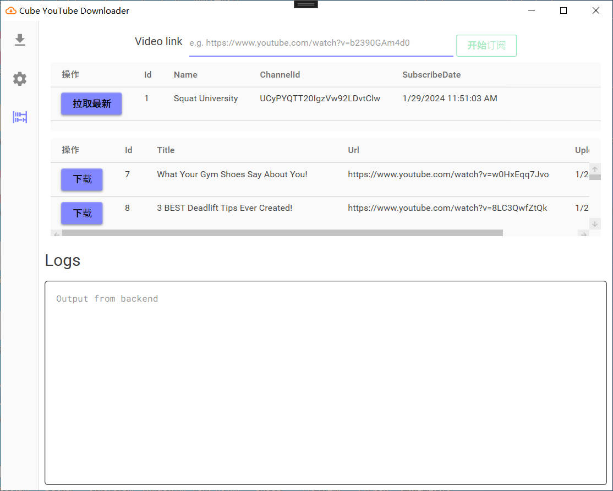
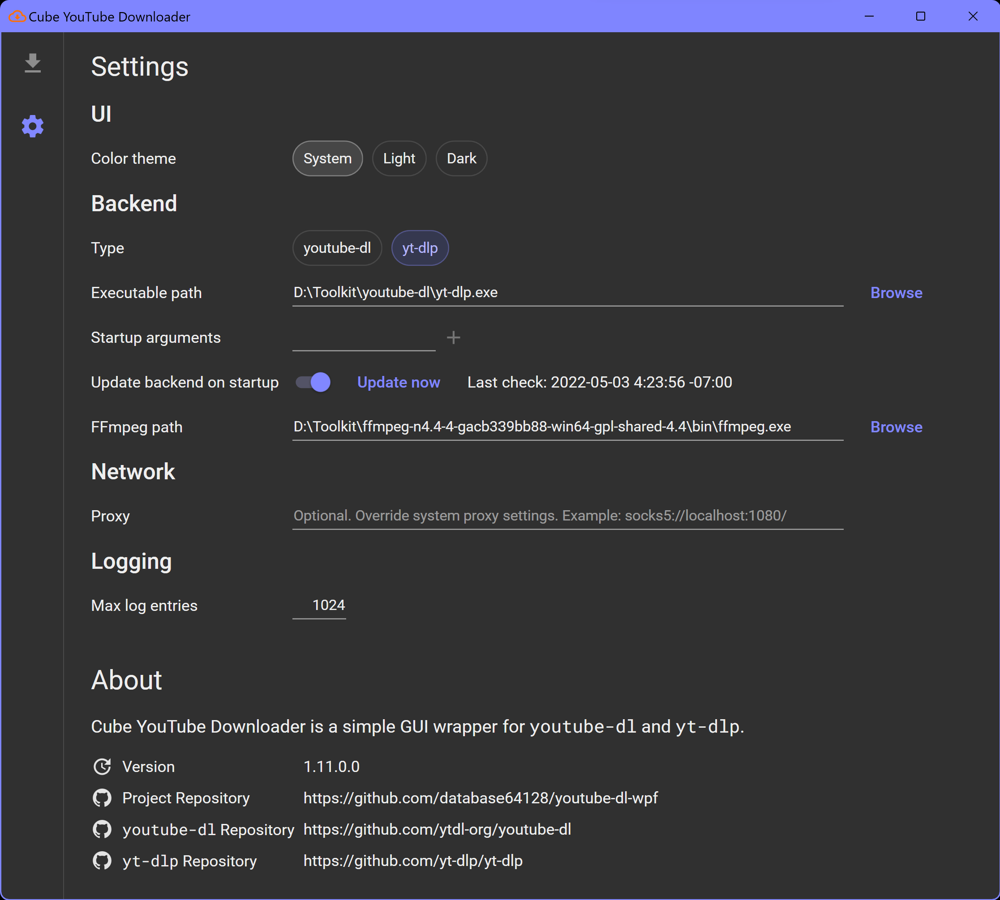

# DNU

轻松将油管的视频转载到B站上面

- [ ] 支持仅转载某个视频
- [ ] 支持指定订阅某个Youtuber
- [ ] 支持下载后自动转录、翻译、合并、上传

WPF GUI for [youtube-dl](https://github.com/ytdl-org/youtube-dl) and [yt-dlp](https://github.com/yt-dlp/yt-dlp).

## 备注

本项目基于 [youtube-dl-wpf](https://github.com/database64128/youtube-dl-wpf) 二次开发，许可证为 [GPLv3](LICENSE)
